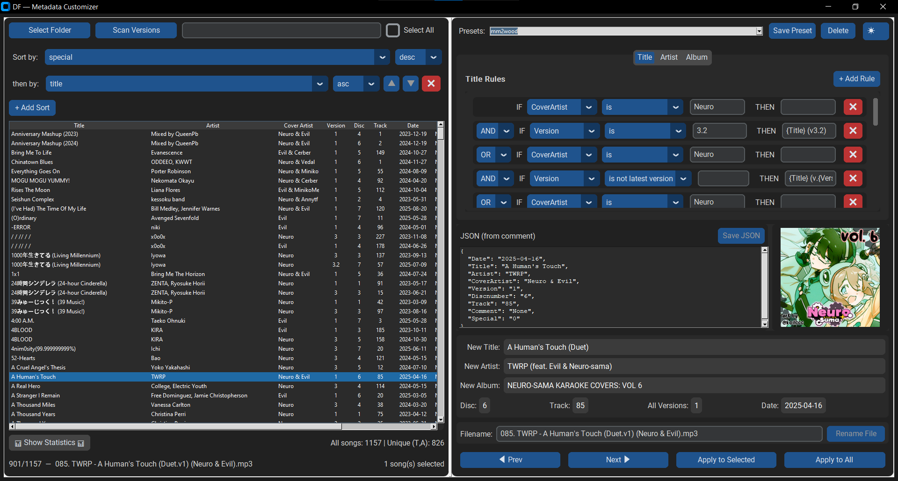
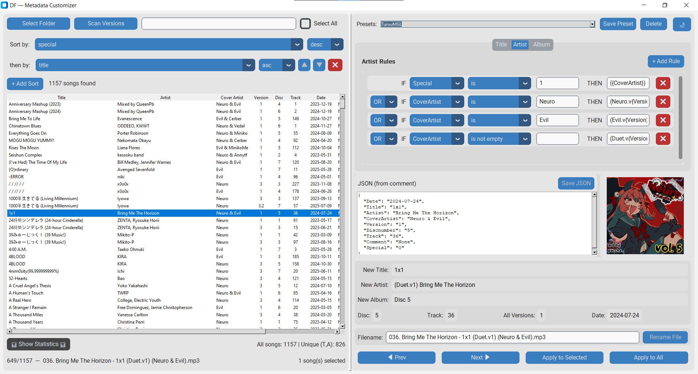
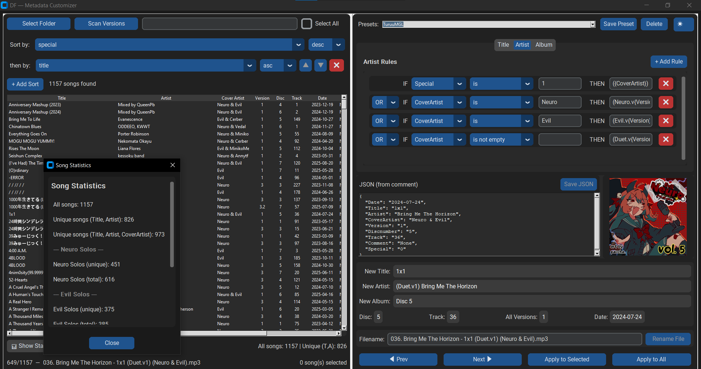

# Database Reformatter — Metadata Customizer

> **Fan Tool Disclaimer**: This application is created by and for fans to help organize cover song collections. It only manages MP3 metadata and does not include any copyrighted content. Users must provide their audio files.

A powerful metadata management tool designed specifically for Neuro-sama and Evil Neuro cover song archives. This application helps standardize ID3 tags across large collections, extract embedded JSON metadata, and apply consistent formatting rules - making your cover song library organized and player-friendly.





## 🎵 What This Tool Does

- Reads existing metadata from your MP3 files
- Applies custom formatting rules to ID3 tags
- Helps maintain consistent naming across collections
- Manages multiple versions of the same cover
- Works with community-shared archive structures
- Advanced song statistics and categorization
- Enhanced multi-level sorting
- Play songs directly from the interface

## ❌ What This Tool Doesn't Do

- Provide or distribute copyrighted music
- Modify audio content
- Include any songs by default

## ✨ Features

### Core Features

- 🎵 **MP3 Metadata Editing** - Read/write ID3 tags
- 📝 **Rule-Based Tagging** - Conditional rules for automatic metadata generation
- 🔍 **JSON in Comments** - Extract metadata from MP3 comment fields
- 🖼️ **Cover Art** - Display and manage album artwork
- 📚 **Version Management** - Track different versions of songs
- 💾 **Preset System** - Save and load rule configurations
- 🚀 **Batch Processing** - Apply changes to multiple files
- 📊 **Advanced Statistics** - Categorize songs by artist type (Neuro Solo, Evil Solo, Duets, Other)
- 🔢 **Multi-Level Sorting** - Sort by up to 5 different fields with ascending/descending options
- ▶️ **Direct Playback** - Double-click to play songs in your default player
- 📝 **JSON Editor** - Edit JSON metadata directly in the app with validation
- ✏️ **File Renaming** - Rename MP3 files directly from the interface
- 🔍 **Enhanced Search** - Version=latest filter and improved search operators

## Installation

1. Download the latest release from the [Releases page](https://github.com/gamerturuu/df-metadata-customizer/releases)
2. Unzip the folder and run the `.exe` file
3. Open the folder to your songs folder

## Neuro-sama / Evil Neuro Use Case

This tool is perfect for managing cover songs from:

- **Neuro-sama** - The AI Vtuber's singing covers
- **Evil Neuro** - The chaotic alternative personality
- **Neuro & Evil Duets** - Collaborative covers

The app reads JSON metadata embedded in MP3 comment fields (common in fan archives) and lets you customize how the tags appear in music players.

### Archive download (Google Drive)

Download [Neuro Karaoke Archive V3](https://drive.google.com/drive/folders/1B1VaWp-mCKk15_7XpFnImsTdBJPOGx7a)

## 📖 Quick Start

### IMPORTANT

📁metadata_presets.json📁 has to be in the same folder as the main app

1. Load Your MP3 Files:
   Click "Select Folder" and choose your Neuro-sama cover song folder.
   The app will scan for MP3 files and extract existing metadata
2. Understand the Data Structure:
   MP3 files should have JSON metadata in their comment fields
   Typical fields:

   ```text
   Date, Title, Artist, CoverArtist, Version, Discnumber, Track, Comment, Special
   ```

3. Create Rules:
   Use the Title/Artist/Album tabs to create conditional rules
   Example: "IF CoverArtist is Neuro THEN Title = [Neuro] {Title}"
   Example: "IF CoverArtist is Evil THEN Title = [Evil] {Title}"

4. Apply Changes:
   Preview changes in the bottom panel
   Use "Apply to Selected" or "Apply to All" to save changes

## Advanced Features

<details>
<summary>📊 Song Statistics</summary>

- Total songs and unique combinations
- Neuro Solos (unique/total)
- Evil Solos (unique/total)
- Neuro & Evil Duets (unique/total)
- Other songs (Neuro & Vedal, etc.)

</details>

<details>
<summary>🔢 Multi-Level Sorting</summary>

Add up to 5 sort rules with custom priorities:

1. Primary sort (e.g., by Disc number)
2. Secondary sort (e.g., by Track number)
3. Tertiary sort (e.g., by Artist)

- Each sort can be ascending or descending
- Rules can be reordered using up/down arrows

</details>

<details>
<summary>🔍 Advanced Search</summary>

Use operators for precise filtering:

- artist=neuro - Contains "neuro" in artist field
- version=latest - Show only latest versions of each song
- disc>=3 - Disc number 3 or higher
- special=1 - Special tagged songs only
- Combine with free text: neuro evil (finds songs containing both words)

</details>

<details>
<summary>📝 Rule Building</summary>

- Rules are evaluated top-to-bottom; first matching rule wins
- Use "AND"/"OR" logic for complex conditions
- Special operators: "is latest version", "is not latest version"
- Template fields: {Title}, {Artist}, {CoverArtist}, {Version}, etc.

</details>

<details>
<summary>📝 File Management</summary>

- Rename files directly in the filename field
- Edit JSON metadata directly with validation
- Presets are saved in individual files in the "presets" folder

</details>

<details>
<summary>🔧 JSON Metadata Format</summary>

The app expects MP3 files to contain JSON in their comment field (example):

```json
{
  "Title": "Original Song Name",
  "Artist": "Original Artist", 
  "CoverArtist": "Neuro",
  "Version": "2",
  "Discnumber": "01",
  "Track": "15",
  "Date": "2024",
  "Comment": "Additional notes",
  "Special": "0"
}
```
</details>

<details>
<summary>🎵 Direct Playback</summary>

- Double-click any song in the list to play it with your system's default player

</details>

## 🔧 Technical Details

- Python 3.10+
- customtkinter
- Pillow (PIL)
- mutagen

## 🙏 Acknowledgments

- Created by and for the Neuro-sama fan community
- Thanks to all contributors and testers
- Special thanks to the [Nyss7](https://discord.com/channels/@me/1433267472496201778) and [mm2wood](https://discord.com/channels/@me/1406566620666794114)

## 🐛 Bug Reports & Feature Requests

Please use the [GitHub Issues](https://github.com/gamerturuu/df-metadata-customizer/issues) page to report bugs or request new features.

## License

This project is licensed under the MIT License.
